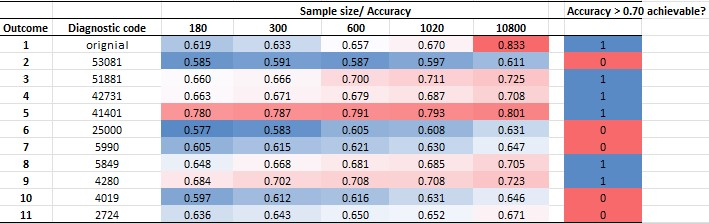
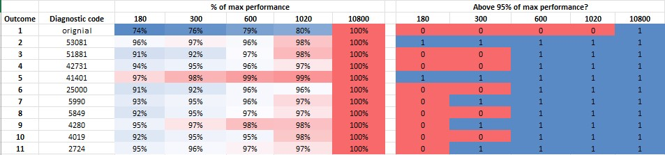
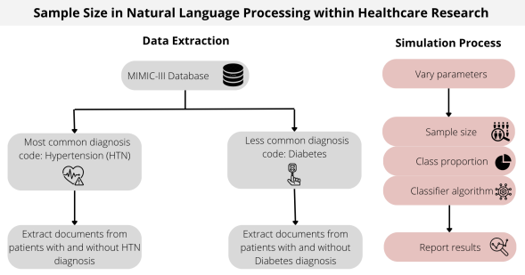

# Sample size for clinical text clasification

### Collaborators: 
Diana Shamsutdinova1, Jaya Chaturvedi1, Saniya Desphande1, Chankai Ma3, Robert Cobb3, Angus Roberts1, Daniel Stahl1 

1Department of Biostatistics and Health Informatics, IoPPN; 

2Department of Informatics, King's College London; 

3Department of Biomedical Engineering, King's College London

### Funding 
The project is funded by the ECR Seed Funding Scheme, King's College London, London, and by the NIHR Maudsley Biomedical Research Centre at South London and Maudsley NHS Foundation Trust and King’s College London, UK. The views expressed are those of the author(s) and not necessarily those of the NIHR or the Department of Health and Social Care.

### Background: 

Classification tasks using natural language processing models (NLP) are often used in clinical research to automate identification of specific information in electronic health records. Such information can be a specific diagnosis (e.g., diabetes, or depression), a symptom (e.g. feeling of pain), or a treatment (e.g. therapy, prescription). This study aims to test sample size requirements for classification models of clinical texts, and how such requirements depend on the language properties of the underlying documents. The practical question we address in this project is whether the 200-500 documents that are usually get annotated in clinical research studies are enough? 

The pilot study was completed by a 2022/2023 MSc student Saniya Deshpande under Daniel Stahl and Diana Shamsutdinova's supervision. It was found that properties such as vocabulary size, word frequencies in different classes of documents, and outcome prevalence, have a significant impact on the optimal size of the training corpus. However, this work was mainly based on classical statistical methods. 

Here, in collaboration with  Chnkai Ma, Robert Cobb, and Jaya Chaturvedi,  we aim to investigate similar questions with the state-of-the-art NLP deep learning models, such as pre-trained large language models (LLM) BERT (subtypes – BERT_base, SAPBERT, Bio-Clinical BERT), LLAMA 2, and Gatortron.

Methods: We utilized a publicly available dataset MIMIC-III. Our annotated corpus of the documents contained MIMIC-III's hospital discharge notes and corresponding ICD-10 diagnoses. We then trained classification models to identify one of the chosen diagnoses. We varied the size of the training corpus to investigate the learning curves of the classification models. Further, we tested whether the learning curves depend on the vocabulary properties of the underlying clinical texts. 

### Results: 
* First, we have found that learning curves of the classification models of different diagnoses varied significantly, despite them using the same underlying preprocessing methods and models. However, further analyses of the text vocabularies were inconclusive, in which variability of the vocabulary complexity did not explain the differences in the learning speeds.

* Half of the modelled outcomes did not reach accuracy of 0.70 or above even with the 10,800 documents (the maximum training size in the experiments).

* The models reached their performance at the sample sizes above 1000-5000, and therefore, existing practice of annotating as little as few hundreds can be suboptimal.

* *n = 600 would be enough to achieve 95% of the performance that would have been possible with the training size of 10,000* for 10 out of 11 modelled diagnoses.

### Limitations and further steps: 
The analysis of the text properties that may underly the differences in the learning curves of the classification NLP models is ongoing, including key words frequencies and distances in the LLMs' document  representations.
We have not explored the modern generative methods that can help increase training data, which is out of scope in the present project.
 
### Code 
The code is available from this repository

### Other related works and resources by the collabolators:

Preprint: [Sample Size in Natural Language Processing within Healthcare Research](https://arxiv.org/abs/2309.02237).

[A useful tool for comparison of different models for a given sample size and class proportion](https://jayachaturvedi-sample-size-in-healthcare-nlp-dashboard-poic0t.streamlit.app/)

